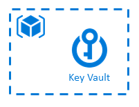
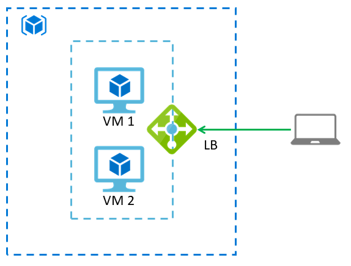

# Workshop Terraform
- **[Prérequis](#prérequis)**
- **[Partie 1: Déployer un projet existant](#partie-1-déployer-un-projet-existant)**
- **[Partie 2: Construire un projet Terraform](#partie-2-construire-un-projet-terraform)**

## Prérequis
- Visual Studio Code
- Extension Terraform
- Subscription Azure avec droits d'admin (Owner). Exemple: subscription MSDN personnelle
  - Service Principal pour cette subscription
- Terraform: 
https://docs.microsoft.com/en-us/azure/virtual-machines/linux/terraform-install-configure 
  - Téléchargement: https://www.terraform.io/downloads.html 
  - Ajouter le chemin du fichier exe aux variables d'environnement (PATH)

### Création du Service Principal
Utiliser Azure CLI ou Azure PowerShell, via le Cloud Shell ou depuis votre poste si il est configuré.

#### Azure CLI (Bash)
- Se connecter à Azure: `az login` (à faire depuis votre poste, pas depuis le Cloud Shell)
- Lister les subscriptions disponibles: `az account list`
- Sélectionner la subscription souhaitée à l'aide de son id: 
    ```
    az account set –s <subscription id>
    ```
- Créer le Service Principal avec le rôle **Contributor** sur la subscription:
    ```
    az ad sp create-for-rbac --role="Contributor" --name "bootcamp201901<name>" --scopes="/subscriptions/<subscription id>"
    ```
  - Récupérer l'output de la commande
- Tester le Service Principal
  - Connection avec le compte: 
    ```
    az login --service-principal -u <name> -p <password> --tenant <tenant>
    ```
  - Lister les resource groups Azure: `az group list`

#### Azure PowerShell
- Se connecter à Azure: `Login-AzAccount` (à faire depuis votre poste, pas depuis le Cloud Shell)
- Lister les subscriptions disponibles: `Get-AzureRmSubscription`
- Sélectionner la subscription souhaitée à l'aide de son id: 
    ```powershell
    $sub=Select-AzSubscription <subscription id>
    ```
- Définir un nom de Service Principal: 
    ```powershell
    $name="bootcamp<name>"
    ```
- Définir un mot de passe pour le Service Principal: 
    ```powershell
    $password="monmotdepasse"
    ```
  - Exécuter la commande: 
    ```powershell
    $securePassword = ConvertTo-SecureString $password -AsPlainText -Force
    ```
- Définir une application dans Azure AD: 
    ```powershell
    $azureAdApplication = New-AzDApplication -DisplayName $name -IdentifierUris "http://$name" -Password $securePassword -Verbose
    ```
- Créer un Service Principal associé à l'application: 
    ```powershell
    $spn = New-AzADServicePrincipal -ApplicationId $($azureAdApplication.ApplicationId)
    ```
- Attribuer le rôle **Contributor** au Service Principal sur la subscription: 
   ```powershell
   New-AzRoleAssignment -RoleDefinitionName "Contributor" -ServicePrincipalName $($azureAdApplication.ApplicationId) -Scope "/subscriptions/<subscription id>"
   ```
- Récupérer les informations de connexions:
    ```powershell
    Write-Output "appId: $($azureAdApplication.ApplicationId)"
    Write-Output "displayName: $name"
    Write-Output "name: http://$name"
    Write-Output "password: $password"
    Write-Output "tenant: $($sub.Tenant.Id)"
    ```
- Tester le Service Principal
  - Connection avec le compte:
    ```powershell
    $cred = New-Object System.Management.Automation.PSCredential ("http://$name", $securePassword)
    Login-AzAccount -Credential $cred -ServicePrincipal -TenantId $($sub.Tenant.Id)
    ```
  - Lister les resource groups Azure: `Get-AzResourceGroup`


## Partie 1: Déployer un projet existant

### Objectifs
- Configurer un projet Terraform pour déployer dans Azure
- Manipuler les commandes Terraform
- Se familiariser avec la structure et la syntaxe d'un projet Terraform

### Scénario
Déploiement d'un Key Vault auquel votre Service Principal a accès. 

 

### Etapes

#### Déploiement
1. Initialiser le projet Terraform à l'aide de la commande `terraform init`
2. Vérifier le plan d'exécution à l'aide de la commande `terraform plan`
3. Déployer le projet à l'aide de la commande `terraform apply`
4. Tester avec la commande `terraform apply` avec le paramètre `-auto-approve` 
5. Récupérer les outputs

## Partie 2: Construire un projet Terraform

### Objectifs
- Mettre en place un projet Terraform à partir d'une architecture
- Réfléchir aux contraintes et dépendances

### Aides
- Site Terraform: https://www.terraform.io/docs/providers/azurerm/
- GitHub: https://github.com/terraform-providers/terraform-provider-azurerm/tree/master/website/docs/r

### Scénarios 
Deux scénarios sont proposés: 
- 1 orienté IaaS
- 1 orienté PaaS 

Des étapes bonus sont proposées pour les 2 scénarios

#### Scénario IaaS

1. Lister les ressources nécessaires
2. Mettre en place le projet Terraform et déployer !

##### Bonus
Eléments supplémentaires à prendre en compte
- Connecter vos ressources à Log analytics
  - **Aides**
    - Déployer un workspace Log Analytics
    - Regarder les providers Terraform: 
      - `azurerm_monitor_diagnostic_setting` 
      - `azurerm_virtual_machine_extension`

#### Scénario PaaS


1. Lister les ressources nécessaires
2. Mettre en place le projet Terraform et déployer !

##### Bonus
Eléments supplémentaires à prendre en compte (peu importe l'ordre)
- Configurer la connection string de la base Azure au niveau de la Web App 
- Configurer le hostname de la Web App au niveau de la Function
- Configurer les informations relatives au service bus et à la queue au niveau de la Function
- Connecter vos ressources à Log analytics
  - **Aides**
    - Déployer un workspace Log Analytics
    - Provider Terraform à utiliser: `azurerm_monitor_diagnostic_setting` 
