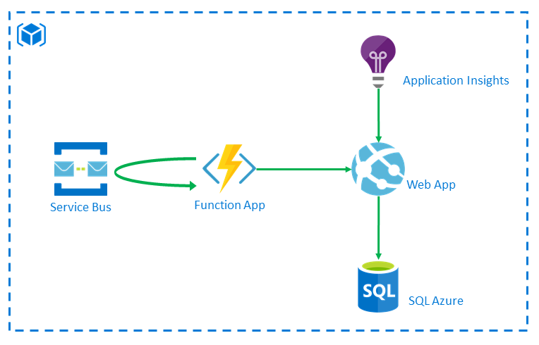

# Workshop Terraform
- **[Prérequis](./prerequis.md)**
- **[Partie 1: Déployer un projet existant](#partie-1-déployer-un-projet-existant)**
- **[Partie 2: Construire un projet Terraform](#partie-2-construire-un-projet-terraform)**

## Partie 1: Déployer un projet existant

### Objectifs
- Configurer un projet Terraform pour déployer dans Azure
- Manipuler les commandes Terraform
- Se familiariser avec la structure et la syntaxe d'un projet Terraform

### Scénario
Déploiement d'un Key Vault auquel votre Service Principal a accès. 

 

### Etapes

#### Déploiement
1. Initialiser le projet Terraform à l'aide de la commande `terraform init`
2. Vérifier le plan d'exécution à l'aide de la commande `terraform plan`
3. Déployer le projet à l'aide de la commande `terraform apply`
4. Tester avec la commande `terraform apply` avec le paramètre `-auto-approve` 
5. Récupérer les outputs

## Partie 2: Construire un projet Terraform

### Objectifs
- Mettre en place un projet Terraform à partir d'une architecture
- Réfléchir aux contraintes et dépendances

### Aides
- Site Terraform: https://www.terraform.io/docs/providers/azurerm/
- GitHub: https://github.com/terraform-providers/terraform-provider-azurerm/tree/master/website/docs/r

### Scénarios 
Deux scénarios sont proposés: 
- 1 orienté IaaS
- 1 orienté PaaS 

Des étapes bonus sont proposées pour les 2 scénarios

#### Scénario IaaS

1. Lister les ressources nécessaires
2. Mettre en place le projet Terraform et déployer !

##### Bonus
Eléments supplémentaires à prendre en compte
- Connecter vos ressources à Log analytics
  - **Aides**
    - Déployer un workspace Log Analytics
    - Regarder les providers Terraform: 
      - `azurerm_monitor_diagnostic_setting` 
      - `azurerm_virtual_machine_extension`

#### Scénario PaaS

1. Lister les ressources nécessaires
2. Mettre en place le projet Terraform et déployer !

##### Bonus
Eléments supplémentaires à prendre en compte (peu importe l'ordre)
- Configurer la connection string de la base Azure au niveau de la Web App 
- Configurer le hostname de la Web App au niveau de la Function
- Configurer les informations relatives au service bus et à la queue au niveau de la Function
- Connecter vos ressources à Log analytics
  - **Aides**
    - Déployer un workspace Log Analytics
    - Provider Terraform à utiliser: `azurerm_monitor_diagnostic_setting` 
